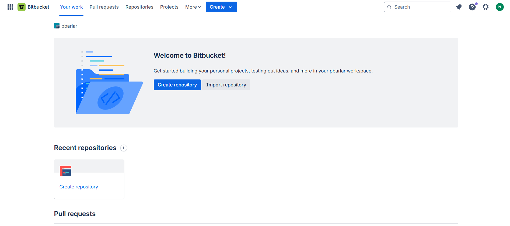
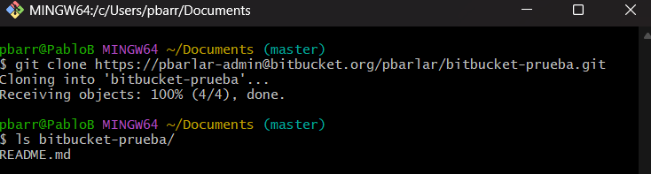
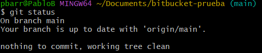
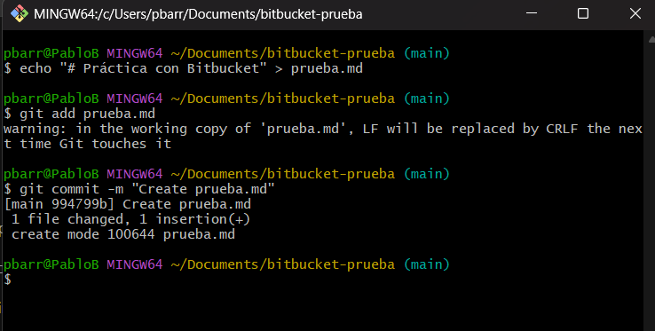
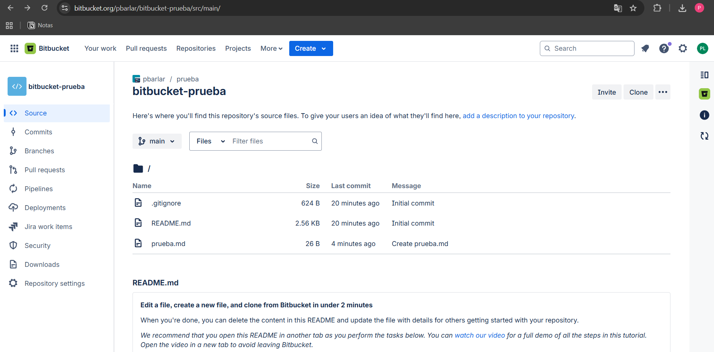
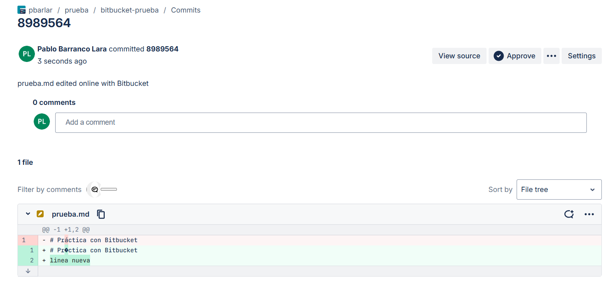
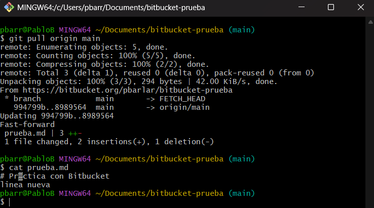

# Comunidades Git BitBucket
Pablo Barranco Lara

## Introducción
El control de versiones es una práctica fundamental en el desarrollo de software moderno, ya que permite llevar un registro histórico de los cambios realizados en el código, colaborar entre múltiples desarrolladores y mantener diferentes versiones de un proyecto de manera organizada.  

El objetivo de este ejercicio es explorar el uso de Bitbucket, documentando los pasos esenciales para:  
- Iniciar sesión.  
- Crear repositorios nuevos.  
- Clonar repositorios en el entorno local.  
- Realizar operaciones básicas de Git: `status`, `add`, `push`, `pull`, `commit`.  

---

## 1. Bitbucket

### 1.1 Inicio de sesión y creación de repositorios
Accedemos a [https://bitbucket.org/](https://bitbucket.org/) e iniciamos sesión o creamos una cuenta.  
En este caso crearé una cuenta nueva. Como vemos, este es el panel principal, que aparece vacío porque no he creado ningún repositorio todavía.
  

Ahora crearemos un repositorio, lo cual se hace con el botón azul que aparece en el centro **“Create repository”** y completaremos la siguiente información:  
- **Project**: podemos crear un nuevo proyecto o usar uno existente.  
- **Repository name**: nombre del repositorio (ejemplo: `bitbucket-prueba`).  
- **Access level**: elegir entre **Private** o **Public**.  
- **Add README**: añadir un archivo `README.md` inicial.  

Presionamos **“Create repository”** y ya tendríamos el repositorio creado. 
 

---

### 1.2 Clonar repositorio en local
Clonamos el repositorio que acabamos de crear en nuestra máquina y usamos `ls` para comprobar que se clonó correctamente y que están los archivos.  

> Nota: en este caso lo clonaré dentro de la carpeta `/Documents` en mi usuario local. 

 

---

### 1.3 Comprobar el estado
Ahora vamos a revisar si hay archivos pendientes de añadir o cambios con un git status:

Como vemos en la foto nuestra directorio local esta actualizado con la rama de bitbucket.

---

### 1.4 Crear un archivo y hacer el primer commit
Ahora crearemos un archivo que lo llamare prueba.md. Este archivo lo añadiremos al 	staging area y luego haremos el commit para confirmar el cambio.

Como vemos el commit se ha hecho correctamente. Para ello haremos un git push origin main para subirlo al repositorio en bitbucket y ver este archivo. Cuando hagamos el push origin nos saltara una pestaña para que iniciemos sesión en Bitbucket para conectarse, iniciaremos sesión y lo tendremos.

---

### 1.5 Obtener cambios con git pull
Para obtener cambios con git pull debemos actualizar el archivo que hemos creado en la 	página de Bitbucket, en este archivo añadiremos una linea (por ejemplo “linea nueva”). 	Después de eso en el git bash haremos el siguiente comando: `git pull origin main`

---

### 1.6 Conclusión
Con estos pasos ya hemos aprendido a:
-  Crear un repositorio en Bitbucket.
-  Clonarlo en nuestro equipo.
-  Hacer commits y subir cambios con push.
-  Obtener actualizaciones con pull.
- Verificar el estado del repositorio con status.
